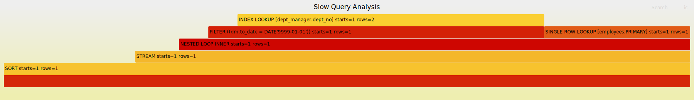
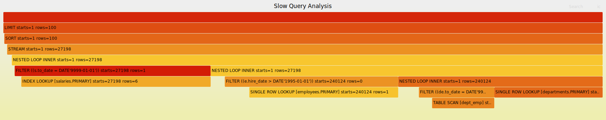
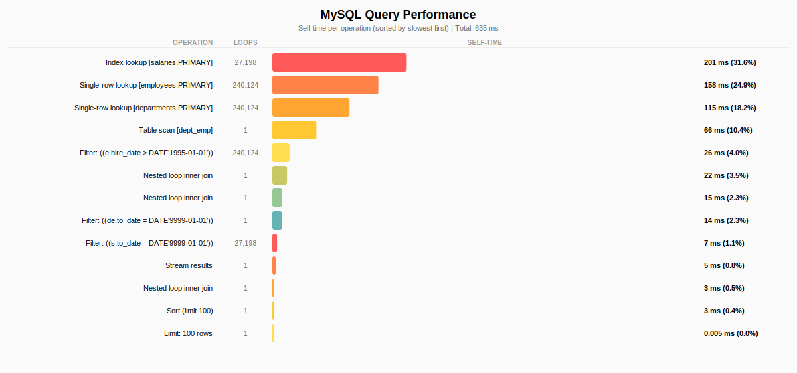

# MySQL EXPLAIN Flame Graphs

Visualize MySQL query execution plans as interactive flame graphs and bar charts. Inspired by [Brendan Gregg's FlameGraph](https://github.com/brendangregg/FlameGraph) project and [Tanel Poder's SQL Plan FlameGraphs](https://tanelpoder.com/posts/visualizing-sql-plan-execution-time-with-flamegraphs/).

## Examples

### Flame Graph (default)
  
<a href="https://vgrippa.github.io/myflames/demos/mysql-query-example-1.svg" target="_blank" rel="noopener">**Open interactive**</a> — zoom, search, tooltips

### Icicle Graph (inverted)
  
<a href="https://vgrippa.github.io/myflames/demos/mysql-query-example-2-inverted.svg" target="_blank" rel="noopener">**Open interactive**</a>

### Custom Colors (green)
  
<a href="https://vgrippa.github.io/myflames/demos/mysql-query-example-3-green.svg" target="_blank" rel="noopener">**Open interactive**</a>

### Bar Chart (self-time breakdown)
  
<a href="https://vgrippa.github.io/myflames/demos/mysql-query-bargraph.svg" target="_blank" rel="noopener">**Open interactive**</a>

### Viewing the demos (interactive zoom, search, tooltips)

The SVGs contain JavaScript for zoom, search, and tooltips. **Opening the raw file URL** (e.g. `raw.githubusercontent.com/.../file.svg`) does **not** run that script—browsers block inline script in SVGs from that origin for security.

Use one of these so the SVG works properly:

| Where | How |
|-------|-----|
| **GitHub Pages** | **[Open interactive demos](https://vgrippa.github.io/myflames/)** — same-origin hosting so the script runs. Enable in repo: *Settings → Pages → Source: Deploy from branch → Branch: master, Folder: /docs*. |
| **Locally** | After cloning, open a demo in your browser (same-origin as `file://`): |
| | `open demos/mysql-query-example-1.svg` (macOS) |
| | `xdg-open demos/mysql-query-example-1.svg` (Linux) |
| | `start demos/mysql-query-example-1.svg` (Windows) |

## Features

- **Flame Graph**: Hierarchical visualization showing query execution flow and time distribution
- **Bar Chart**: Simple horizontal bar chart sorted by self-time (slowest operations first)
- **Auto-scaling**: Automatically switches between milliseconds (ms) and microseconds (µs) for fast queries
- **Rich Tooltips**: Hover to see detailed metrics (rows, loops, cost, conditions, etc.)
- **Interactive**: Click to zoom, search operations, keyboard shortcuts

## Prerequisites

- Perl 5.x (included on most Unix/Linux/macOS systems)
- MySQL 8.4+ with `EXPLAIN ANALYZE FORMAT=JSON` and JSON format version 2

### MySQL Configuration

This tool requires the new JSON format version 2 for EXPLAIN output, available in MySQL 8.4+:

```sql
SET explain_json_format_version = 2;
```

To make it permanent, add to your `my.cnf`:
```ini
[mysqld]
explain_json_format_version = 2
```

## Installation

```bash
git clone https://github.com/vgrippa/myflames.git
cd myflames
chmod +x *.pl
```

## Quick Start

### Step 1: Get EXPLAIN ANALYZE output from MySQL

```sql
EXPLAIN ANALYZE FORMAT=JSON
SELECT e.first_name, e.last_name, d.dept_name
FROM employees e
JOIN dept_emp de ON e.emp_no = de.emp_no
JOIN departments d ON de.dept_no = d.dept_no
WHERE e.hire_date > '1995-01-01';
```

Save the JSON output to a file:

```bash
mysql -u user -p database -e "EXPLAIN ANALYZE FORMAT=JSON SELECT ..." > explain.json
```

### Example JSON Output

The JSON output from `EXPLAIN ANALYZE FORMAT=JSON` looks like this:

```json
{
  "query": "/* select#1 */ select ... from `employees`.`employees` where ...",
  "covering": false,
  "operation": "Index lookup on employees using idx_covered_last_first_name (last_name='Facello', first_name='Georgi')",
  "index_name": "idx_covered_last_first_name",
  "query_type": "select",
  "table_name": "employees",
  "access_type": "index",
  "actual_rows": 2.0,
  "schema_name": "employees",
  "actual_loops": 1,
  "used_columns": ["emp_no", "birth_date", "first_name", "last_name", "gender", "hire_date"],
  "estimated_rows": 2.0,
  "lookup_condition": "last_name='Facello', first_name='Georgi'",
  "index_access_type": "index_lookup",
  "actual_last_row_ms": 0.111209,
  "actual_first_row_ms": 0.107751,
  "estimated_total_cost": 0.7
}
```

Key fields used by the visualization:
- `operation`: The operation being performed
- `actual_rows`: Actual number of rows processed
- `actual_loops`: Number of times this operation was executed
- `actual_last_row_ms`: Time in milliseconds to complete the operation
- `table_name`, `index_name`: Table and index being accessed

### Step 2: Generate Visualizations

**Flame Graph** (recommended):
```bash
./mysql-explain-flamegraph.pl explain.json > query.svg
```

**Bar Chart** (self-time focused):
```bash
./mysql-explain-bargraph.pl explain.json > query-bar.svg
```

### Step 3: View Results

Open the SVG file in any web browser:
```bash
open query.svg        # macOS
xdg-open query.svg    # Linux
start query.svg       # Windows
```

## Usage

### Flame Graph Generator

```bash
./mysql-explain-flamegraph.pl [options] explain.json > output.svg
```

**Options:**
| Option | Default | Description |
|--------|---------|-------------|
| `--width N` | 1800 | SVG width in pixels |
| `--height N` | 32 | Frame height in pixels |
| `--colors SCHEME` | hot | Color scheme: hot, mem, io, red, green, blue |
| `--title TEXT` | "MySQL Query Plan" | Chart title |
| `--inverted` | (off) | Generate icicle graph (inverted flame graph) |
| `--no-enhance` | (enabled) | Disable detailed tooltips |

**Examples:**
```bash
# Basic usage
./mysql-explain-flamegraph.pl explain.json > query.svg

# Custom title and width
./mysql-explain-flamegraph.pl --title "Slow Query Analysis" --width 2400 explain.json > query.svg

# Icicle graph (inverted)
./mysql-explain-flamegraph.pl --title "Slow Query Analysis" --inverted explain.json > query-inverted.svg

# Green color scheme
./mysql-explain-flamegraph.pl --title "Slow Query Analysis" --colors green explain.json > query-green.svg

# Memory-style colors
./mysql-explain-flamegraph.pl --colors mem explain.json > query.svg
```

### Bar Chart Generator

```bash
./mysql-explain-bargraph.pl [options] explain.json > output.svg
```

**Options:**
| Option | Default | Description |
|--------|---------|-------------|
| `--width N` | 1200 | SVG width in pixels |
| `--title TEXT` | "MySQL Query Performance" | Chart title |

**Examples:**
```bash
# Basic usage
./mysql-explain-bargraph.pl explain.json > query-bar.svg

# Custom title
./mysql-explain-bargraph.pl --title "Query Bottlenecks" explain.json > query-bar.svg
```

## How to Read the Flame Graph

### Structure
- **Read bottom-to-top**: The query starts at the bottom, child operations stack upward
- **Width = Time**: Wider bars took more total time (including children)
- **Self-time**: The visible "top" of each bar represents time spent in that operation alone

### Labels (Tanel Poder style)
Each operation shows:
```
OPERATION [table.index] starts=X rows=Y
```

| Field | Meaning |
|-------|---------|
| `starts=X` | Number of times this operation executed (loops) |
| `rows=Y` | Number of rows produced per execution |

### Example Interpretation
```
INDEX LOOKUP [orders.idx_customer] starts=1000 rows=5
```
This means: The index lookup ran **1000 times** (nested loop), returning **5 rows** each time.

### Interactive Features
- **Hover**: See detailed metrics (actual vs estimated rows, timing, cost, conditions)
- **Click**: Zoom into a specific operation
- **Search**: Press `/` or click "Search" to find operations
- **Reset**: Click "Reset Zoom" to return to full view

## How to Read the Bar Chart

The bar chart shows operations sorted by **self-time** (time spent in that operation alone, excluding children):

- **Top = Slowest**: The slowest operations appear at the top
- **Percentage**: Shows what portion of total time each operation consumed
- **Best for**: Quickly identifying bottlenecks

## Time Unit Auto-Detection

Both tools automatically detect query speed and adjust units:

| Total Query Time | Unit Used |
|------------------|-----------|
| ≥ 1 millisecond | **ms** (milliseconds) |
| < 1 millisecond | **µs** (microseconds) |

This ensures even sub-millisecond operations are visible in the visualization.

## Tooltip Information

When hovering over operations, you'll see:

| Field | Description |
|-------|-------------|
| **Table** | Schema.table (index: name) |
| **Access** | Access type (index, filter, table scan, etc.) |
| **Rows** | Actual vs estimated rows (with accuracy warnings) |
| **Loops** | Number of iterations |
| **Time** | First row and last row timing |
| **Cost** | Optimizer estimated cost |
| **Condition** | Filter/join condition |
| **Ranges** | Index scan ranges |
| **Covering** | Whether index covers all needed columns |

## Advanced Usage

### Using with MySQL Client

```bash
# Direct pipe from MySQL
mysql -u user -p -N -e "EXPLAIN ANALYZE FORMAT=JSON SELECT ..." database | \
  ./mysql-explain-flamegraph.pl > query.svg
```

### Comparing Multiple Queries

```bash
# Generate multiple flame graphs
./mysql-explain-flamegraph.pl --title "Before Optimization" before.json > before.svg
./mysql-explain-flamegraph.pl --title "After Optimization" after.json > after.svg
```

### Lower-Level Tools

For advanced use cases, you can use the individual components:

```bash
# Generate folded stacks only (for use with other tools)
./stackcollapse-mysql-explain-json.pl explain.json > stacks.txt

# Use with original flamegraph.pl
./stackcollapse-mysql-explain-json.pl explain.json | \
  ./flamegraph.pl --colors hot --title "Query" > query.svg
```

## Troubleshooting

### "Cannot find flamegraph.pl"
Ensure `flamegraph.pl` is in the same directory as `mysql-explain-flamegraph.pl`.

### Empty or minimal output
Make sure you're using `EXPLAIN ANALYZE FORMAT=JSON`, not just `EXPLAIN FORMAT=JSON`. The `ANALYZE` keyword is required for actual execution timing.

### SVG rendering errors
If you see XML parsing errors, ensure your MySQL version outputs valid JSON. Some special characters in table names may need escaping.

## Credits

- [Brendan Gregg's FlameGraph](https://github.com/brendangregg/FlameGraph) - Original flame graph implementation
- [Tanel Poder](https://tanelpoder.com/) - SQL Plan FlameGraph concept and label format inspiration

## License

This project extends Brendan Gregg's FlameGraph project. See [LICENSE](LICENSE) for details.
