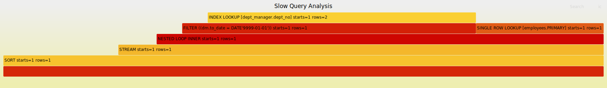
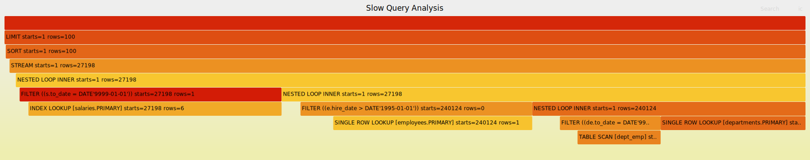
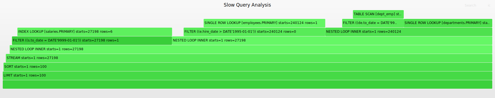
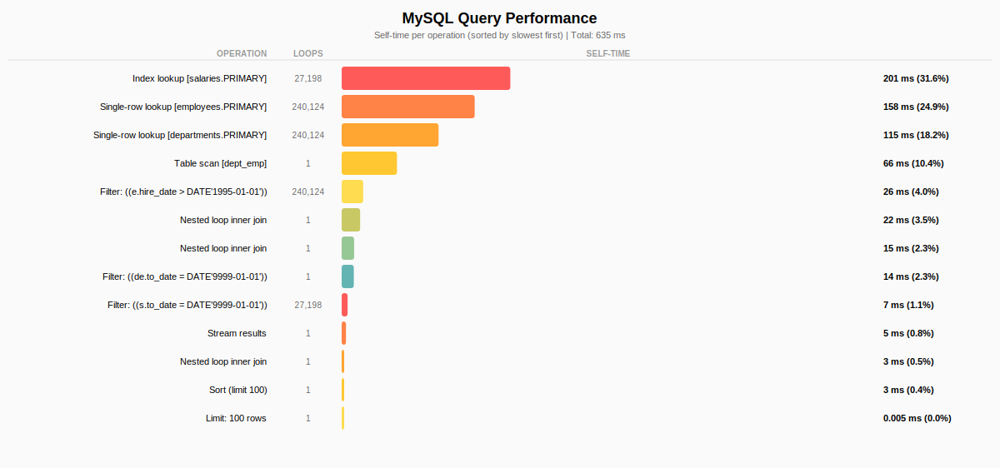
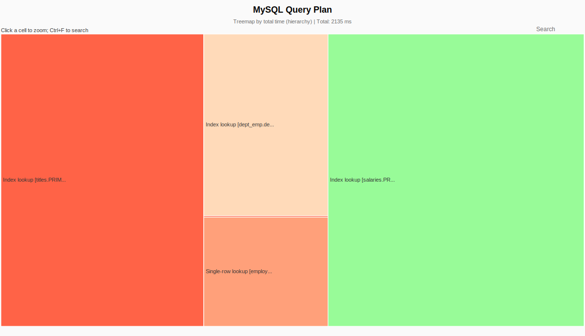

# MySQL EXPLAIN Flame Graphs

Visualize MySQL query execution plans as interactive flame graphs, bar charts, and treemaps. All views use a **single unified parser**. Inspired by [Brendan Gregg's FlameGraph](https://github.com/brendangregg/FlameGraph) project and [Tanel Poder's SQL Plan FlameGraphs](https://tanelpoder.com/posts/visualizing-sql-plan-execution-time-with-flamegraphs/).

**Migration:** The project now uses **Python** as the main implementation. The original **Perl** scripts are still in the repo; for instructions and options specific to the Perl version, see **[LEGACY-PERL.md](LEGACY-PERL.md)**.

## Examples

### Flame Graph (default)
  
<a href="https://vgrippa.github.io/myflames/demos/mysql-query-example-1.html" target="_blank" rel="noopener">**Open interactive**</a> — full page, zoom, search, tooltips

### Icicle Graph (inverted)
  
<a href="https://vgrippa.github.io/myflames/demos/mysql-query-example-2-inverted.html" target="_blank" rel="noopener">**Open interactive**</a>

### Custom Colors (green)
  
<a href="https://vgrippa.github.io/myflames/demos/mysql-query-example-3-green.html" target="_blank" rel="noopener">**Open interactive**</a>

### Bar Chart (self-time breakdown)
  
<a href="https://vgrippa.github.io/myflames/demos/mysql-query-bargraph.html" target="_blank" rel="noopener">**Open interactive**</a>

### Treemap (hierarchy by total time)
  
<a href="https://vgrippa.github.io/myflames/demos/mysql-query-treemap.html" target="_blank" rel="noopener">**Open interactive**</a> — click to zoom, search, tooltips

### Viewing the demos (interactive zoom, search, tooltips)

The SVGs contain JavaScript for zoom, search, and tooltips. **Opening the raw file URL** (e.g. `raw.githubusercontent.com/.../file.svg`) does **not** run that script—browsers block inline script in SVGs from that origin for security.

Use one of these so the SVG works properly:

| Where | How |
|-------|-----|
| **GitHub Pages** | The “Open interactive” links above open a full-page view with JavaScript enabled (zoom, search, tooltips). Requires *Settings → Pages → Deploy from branch → Branch: master, Folder: /docs*. |
| **All demos** | **[Index page](https://vgrippa.github.io/myflames/)** — all demos in one page. |
| **Locally** | After cloning, open a demo in your browser (same-origin as `file://`): |
| | `open demos/mysql-query-example-1.svg` (macOS) |
| | `xdg-open demos/mysql-query-example-1.svg` (Linux) |
| | `start demos/mysql-query-example-1.svg` (Windows) |

## Features

- **Flame Graph**: Hierarchical visualization showing query execution flow and time distribution
- **Bar Chart**: Simple horizontal bar chart sorted by self-time (slowest operations first)
- **Treemap**: Hierarchical rectangles by total time (area = time)
- **Diagram**: Visual Explain–style execution plan (left-to-right flow, access boxes, nested-loop diamonds, costs and row counts)
- **Single parser**: One code path parses the JSON; all output types share the same data
- **Auto-scaling**: Automatically switches between milliseconds (ms) and microseconds (µs) for fast queries
- **Rich Tooltips**: Hover to see detailed metrics (rows, loops, cost, conditions, etc.)
- **Interactive**: Click to zoom, search operations, keyboard shortcuts

## Prerequisites

- **Python 3.7+** — no extra packages required
- MySQL 8.4+ with `EXPLAIN ANALYZE FORMAT=JSON` and JSON format version 2  
  *(For the legacy Perl scripts instead, see [LEGACY-PERL.md](LEGACY-PERL.md).)*

### MySQL Configuration

This tool requires the new JSON format version 2 for EXPLAIN output, available in MySQL 8.4+:

```sql
SET explain_json_format_version = 2;
```

To make it permanent, add to your `my.cnf`:
```ini
[mysqld]
explain_json_format_version = 2
```

## Installation

```bash
git clone https://github.com/vgrippa/myflames.git
cd myflames
```

No install step for Python: run from the repo root with `python3 -m myflames` or `python3 mysql_explain.py`.

**Testing:** `python3 -m myflames test/mysql-explain-json-sample.json > out.svg`. See [test/README.md](test/README.md). Upstream FlameGraph tests: `./test.sh` (requires `test/results/`).

**Using the old Perl scripts?** See [LEGACY-PERL.md](LEGACY-PERL.md) for Perl-only installation and usage.

## Quick Start

### Step 1: Get EXPLAIN ANALYZE output from MySQL

```sql
EXPLAIN ANALYZE FORMAT=JSON
SELECT e.first_name, e.last_name, d.dept_name
FROM employees e
JOIN dept_emp de ON e.emp_no = de.emp_no
JOIN departments d ON de.dept_no = d.dept_no
WHERE e.hire_date > '1995-01-01';
```

Save the JSON output to a file:

```bash
mysql -u user -p database -e "EXPLAIN ANALYZE FORMAT=JSON SELECT ..." > explain.json
```

### Example JSON Output

The JSON output from `EXPLAIN ANALYZE FORMAT=JSON` looks like this:

```json
{
  "query": "/* select#1 */ select ... from `employees`.`employees` where ...",
  "covering": false,
  "operation": "Index lookup on employees using idx_covered_last_first_name (last_name='Facello', first_name='Georgi')",
  "index_name": "idx_covered_last_first_name",
  "query_type": "select",
  "table_name": "employees",
  "access_type": "index",
  "actual_rows": 2.0,
  "schema_name": "employees",
  "actual_loops": 1,
  "used_columns": ["emp_no", "birth_date", "first_name", "last_name", "gender", "hire_date"],
  "estimated_rows": 2.0,
  "lookup_condition": "last_name='Facello', first_name='Georgi'",
  "index_access_type": "index_lookup",
  "actual_last_row_ms": 0.111209,
  "actual_first_row_ms": 0.107751,
  "estimated_total_cost": 0.7
}
```

Key fields used by the visualization:
- `operation`: The operation being performed
- `actual_rows`: Actual number of rows processed
- `actual_loops`: Number of times this operation was executed
- `actual_last_row_ms`: Time in milliseconds to complete the operation
- `table_name`, `index_name`: Table and index being accessed

### Step 2: Generate visualizations (Python myflames)

One parser, choose output with `--type`:

```bash
# Flame graph (default)
python3 -m myflames explain.json > query.svg
# or: python3 mysql_explain.py explain.json > query.svg

# Bar chart (self-time focused)
python3 -m myflames --type bargraph explain.json > query-bar.svg

# Treemap (hierarchy by total time)
python3 -m myflames --type treemap explain.json > query-treemap.svg

# Diagram (Visual Explain–style flow)
python3 -m myflames --type diagram explain.json > query-diagram.svg
```

### Step 3: View Results

Open the SVG file in any web browser:
```bash
open query.svg        # macOS
xdg-open query.svg    # Linux
start query.svg       # Windows
```

## Usage

### Unified command (recommended)

All output types use the **same parser**: one code path reads the JSON and builds the plan tree; then the chosen visualization is generated.

```bash
python3 -m myflames [--type flamegraph|bargraph|treemap|diagram] [options] explain.json > output.svg
```

**Options (unified):**

| Option | Default | Applies to | Description |
|--------|---------|------------|-------------|
| `--type TYPE` | flamegraph | all | Output: `flamegraph`, `bargraph`, `treemap`, or `diagram` |
| `--diagram-engine ENGINE` | svg | diagram | Layout: `svg` (built-in) or `graphviz` (requires [Graphviz](https://graphviz.org/) installed) |
| `--width N` | 1800 (fg), 1200 (bar/treemap/diagram) | all | SVG width in pixels |
| `--height N` | 32 | flamegraph | Frame height in pixels |
| `--colors SCHEME` | hot | flamegraph | Color scheme: hot, mem, io, red, green, blue |
| `--title TEXT` | "MySQL Query Plan" | all | Chart title |
| `--inverted` | off | flamegraph | Icicle graph (inverted) |
| `--enhance` / `--no-enhance` | on | flamegraph | Detailed tooltips |

Examples:

```bash
python3 -m myflames explain.json > query.svg
python3 -m myflames --type bargraph explain.json > query-bar.svg
python3 -m myflames --type treemap explain.json > query-treemap.svg
python3 -m myflames --type diagram explain.json > query-diagram.svg
python3 -m myflames --title "Slow Query" --colors hot explain.json > query.svg
```

### Flame Graph (default)

Same as `python3 -m myflames` or `python3 -m myflames --type flamegraph`. Wrapper: `python3 mysql_explain_flamegraph.py [options] explain.json > output.svg`.

**Options:**
| Option | Default | Description |
|--------|---------|-------------|
| `--width N` | 1800 | SVG width in pixels |
| `--height N` | 32 | Frame height in pixels |
| `--colors SCHEME` | hot | Color scheme: hot, mem, io, red, green, blue |
| `--title TEXT` | "MySQL Query Plan" | Chart title |
| `--inverted` | (off) | Generate icicle graph (inverted flame graph) |
| `--no-enhance` | (enabled) | Disable detailed tooltips |

**Examples:**
```bash
# Basic usage
python3 -m myflames explain.json > query.svg

# Custom title and width
python3 -m myflames --title "Slow Query Analysis" --width 2400 explain.json > query.svg

# Icicle graph (inverted)
python3 -m myflames --inverted explain.json > query-inverted.svg

# Color scheme (hot is default)
python3 -m myflames --colors hot explain.json > query.svg
```

### Bar Chart

Same as `python3 -m myflames --type bargraph`. Wrapper: `python3 mysql_explain_bargraph.py [options] explain.json > output.svg`.

**Options:**
| Option | Default | Description |
|--------|---------|-------------|
| `--width N` | 1200 | SVG width in pixels |
| `--title TEXT` | "MySQL Query Performance" | Chart title |

**Examples:**
```bash
python3 -m myflames --type bargraph explain.json > query-bar.svg
python3 -m myflames --type bargraph --title "Query Bottlenecks" explain.json > query-bar.svg
```

### Treemap

Hierarchical treemap: each node is a rectangle; area is proportional to total time (including children). Interactive: click a cell to zoom, use Search to highlight by regex, hover for details.

Uses the same `--width` and `--title` options as other types (see unified options table above).

```bash
python3 -m myflames --type treemap explain.json > query-treemap.svg
python3 -m myflames --type treemap --title "Query plan" explain.json > out.svg
```

### Diagram

Visual Explain–style execution plan aligned with **MySQL Workbench’s Visual Explain**: left-to-right flow, **table access** boxes (operation, table, index), **nested loop** diamonds with two inputs (outer on main line, inner from below), row counts on arrows and at boxes, time/cost in tooltips. Color is **time-based** (hot = more time, cold = less). Layout and conventions follow the replication guide in `mysql-workbench/docs/VISUAL_EXPLAIN_PLAN_CONTEXT.md`; see [docs/VISUAL_EXPLAIN_REFERENCE.md](docs/VISUAL_EXPLAIN_REFERENCE.md) for the mapping.

Uses the same `--width` and `--title` options as other types. By default the diagram uses the built-in SVG layout. If you have [Graphviz](https://graphviz.org/) installed, you can use `--diagram-engine graphviz` for automatic layout; if `dot` is not on PATH, the tool falls back to the built-in diagram and prints a warning.

```bash
python3 -m myflames --type diagram explain.json > query-diagram.svg
python3 -m myflames --type diagram --title "Execution plan" explain.json > plan.svg
python3 -m myflames --type diagram --diagram-engine graphviz explain.json > query-diagram.svg
```

## How to Read the Flame Graph

### Structure
- **Read bottom-to-top**: The query starts at the bottom, child operations stack upward
- **Width = Time**: Wider bars took more total time (including children)
- **Self-time**: The visible "top" of each bar represents time spent in that operation alone

### Labels (Tanel Poder style)
Each operation shows:
```
OPERATION [table.index] starts=X rows=Y
```

| Field | Meaning |
|-------|---------|
| `starts=X` | Number of times this operation executed (loops) |
| `rows=Y` | Number of rows produced per execution |

### Example Interpretation
```
INDEX LOOKUP [orders.idx_customer] starts=1000 rows=5
```
This means: The index lookup ran **1000 times** (nested loop), returning **5 rows** each time.

### Interactive Features (flame graph and treemap)
- **Hover**: See detailed metrics (actual vs estimated rows, timing, cost, conditions)
- **Click**: Zoom into a specific operation (treemap: click cell to zoom; click again or "Reset Zoom" to reset)
- **Search**: Click "Search" or press Ctrl+F, enter a regex to highlight matching operations
- **Reset**: Click "Reset Zoom" to return to full view

## How to Read the Bar Chart

The bar chart shows operations sorted by **self-time** (time spent in that operation alone, excluding children):

- **Top = Slowest**: The slowest operations appear at the top
- **Percentage**: Shows what portion of total time each operation consumed
- **Best for**: Quickly identifying bottlenecks

## Time Unit Auto-Detection

All output types (flamegraph, bargraph, treemap) automatically detect query speed and adjust units:

| Total Query Time | Unit Used |
|------------------|-----------|
| ≥ 1 millisecond | **ms** (milliseconds) |
| < 1 millisecond | **µs** (microseconds) |

This ensures even sub-millisecond operations are visible in the visualization.

## Tooltip Information

When hovering over operations, you'll see:

| Field | Description |
|-------|-------------|
| **Table** | Schema.table (index: name) |
| **Access** | Access type (index, filter, table scan, etc.) |
| **Rows** | Actual vs estimated rows (with accuracy warnings) |
| **Loops** | Number of iterations |
| **Time** | First row and last row timing |
| **Cost** | Optimizer estimated cost |
| **Condition** | Filter/join condition |
| **Ranges** | Index scan ranges |
| **Covering** | Whether index covers all needed columns |

## Advanced Usage

### Using with MySQL Client

Pipe EXPLAIN output directly into the unified command. Use `--type` to choose the visualization:

```bash
# Flame graph (default)
mysql -u user -p -N -e "EXPLAIN ANALYZE FORMAT=JSON SELECT ..." database | \
  python3 -m myflames > query.svg

# Bar chart, treemap, or diagram
mysql ... | python3 -m myflames --type bargraph > query-bar.svg
mysql ... | python3 -m myflames --type treemap > query-treemap.svg
mysql ... | python3 -m myflames --type diagram > query-diagram.svg
```

### Comparing Multiple Queries

Generate before/after views in any type:

```bash
python3 -m myflames --title "Before Optimization" before.json > before.svg
python3 -m myflames --title "After Optimization" after.json > after.svg
python3 -m myflames --type bargraph --title "Before" before.json > before-bar.svg
python3 -m myflames --type treemap --title "After" after.json > after-treemap.svg
```

### Lower-Level Tools

Generate folded stacks only (for use with other tools):

```bash
python3 stackcollapse_mysql_explain_json.py explain.json > stacks.txt
```

For normal use, prefer `python3 -m myflames` for the full parser and options (e.g. enhanced tooltips). For the Perl stack-collapse script, see [LEGACY-PERL.md](LEGACY-PERL.md).

## Troubleshooting

### "No module named 'myflames'"
Run from the repo root so the `myflames` package is on the path, or use `python3 mysql_explain.py` from the repo root.

### Empty or minimal output
Make sure you're using `EXPLAIN ANALYZE FORMAT=JSON`, not just `EXPLAIN FORMAT=JSON`. The `ANALYZE` keyword is required for actual execution timing.

### SVG rendering errors
If you see XML parsing errors, ensure your MySQL version outputs valid JSON. Some special characters in table names may need escaping.

## Documentation

- **[LEGACY-PERL.md](LEGACY-PERL.md)** — Perl scripts and options (legacy).
- **[docs/VISUAL_EXPLAIN_REFERENCE.md](docs/VISUAL_EXPLAIN_REFERENCE.md)** — Visual Explain diagram mapping and conventions.
- **[docs/prompts/](docs/prompts/)** — Context and prompts used to create myflames (for reproducibility and contributors).

## Credits

- [Brendan Gregg's FlameGraph](https://github.com/brendangregg/FlameGraph) - Original flame graph implementation
- [Tanel Poder](https://tanelpoder.com/) - SQL Plan FlameGraph concept and label format inspiration

## License

This project extends Brendan Gregg's FlameGraph project. See [docs/cddl1.txt](docs/cddl1.txt) (CDDL 1.0) for license details.
