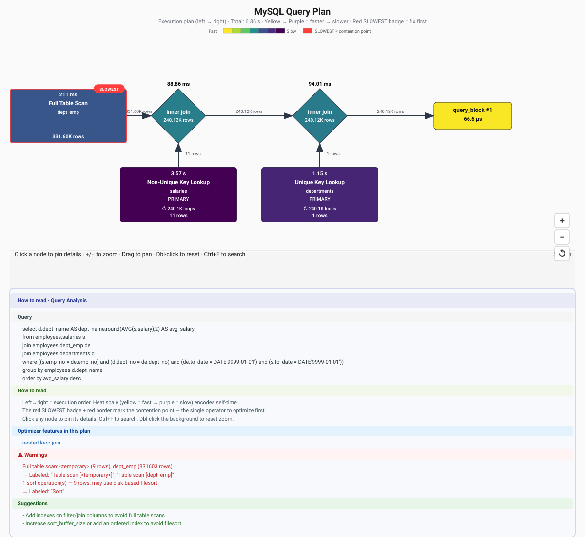

<p align="center">
  
</p>

# myflames

myflames turns MySQL and MariaDB query plans into interactive charts. Use it to inspect where a query spends time, compare plans before and after a change, or export the analysis as JSON and plain text.

The core package uses Python's standard library. Reports open in a browser and can be shared as HTML files.

Inspired by [Brendan Gregg's FlameGraph](https://github.com/brendangregg/FlameGraph) and [Tanel Poder's SQL Plan FlameGraphs](https://tanelpoder.com/posts/visualizing-sql-plan-execution-time-with-flamegraphs/).



[Install](#install) · [Quick start](#quick-start-file-mode) · [Local UI](#local-ui) · [Views and demos](#output-types) · [Join samples](#query-samples-inner-join-and-left-join) · [Live connection](#live-connection-mode) · [CLI reference](#cli-reference) · [Documentation](#documentation)

## Install

```bash
pip install myflames
# Or install into an isolated environment:
pipx install myflames
```

### Requirements

- Python 3.7 or later for the core package.
- MySQL 8.4 or later, using JSON format version 2, or MariaDB 10.11 or later.
- A `mysql` or `mariadb` command-line client for live connections. Reading a saved plan does not require a running database.

The [September 2026 review](docs/reviews/2026-09-15.md) tested a fresh MySQL 26.7.0 plan corpus and live connections.

Optional integrations have their own dependencies:

```bash
pip install 'myflames[mcp]'     # MCP server
pip install 'myflames[tokens]'  # Anthropic token counting
pip install 'myflames[gpt]'     # GPT token counting with tiktoken
```

## Quick start (file mode)

Capture a plan from MySQL:

```bash
mysql -u user -p mydb --batch --skip-column-names --raw -e \
  "SET explain_json_format_version=2; EXPLAIN ANALYZE FORMAT=JSON SELECT * FROM orders WHERE user_id = 1" \
  > explain.json
```

For MariaDB, use `ANALYZE FORMAT=JSON`:

```bash
mariadb -u user -p mydb --batch --skip-column-names --raw -e \
  "ANALYZE FORMAT=JSON SELECT * FROM orders WHERE user_id = 1" \
  > explain.json
```

Both commands execute the query to measure it. Choose a query and database where that execution is appropriate.

Render the saved plan:

```bash
myflames explain.json --output report.html
```

This writes `report.html` and a JSON analysis file, `report.json`. Open the HTML file in a browser. The report also links to algorithm lessons; by default, myflames writes a `teach/` directory beside it.

For an SVG or a pipeline:

```bash
myflames explain.json > query.svg
cat explain.json | myflames --type diagram > query-diagram.svg
```

To try the tool from a source checkout without a database:

```bash
python3 -m myflames test/mysql-explain-json-sample.json --output report.html
```

You can also paste a plan into the [browser playground](https://vgrippa.github.io/myflames/playground/). It loads the published package through Pyodide and processes the plan in your browser.

## Local UI

```bash
myflames ui
```

This starts a local workspace in your browser. Import a saved plan, or capture
one from a live server, then switch between charts, focus or collapse branches,
and compare row estimates against measured rows. Operators link to the
Teach lesson that explains it. You can compare a plan against a saved baseline
after changing an index or the query.

Live captures run either as an estimate (`EXPLAIN`) or a measured execution
(`EXPLAIN ANALYZE`). You can bind named parameters, set a timeout, cancel a
run, repeat it up to 10 times, and collect the optimizer trace. Plans and SQL
drafts stay in the browser tab until you choose **Save investigation**, which
stores plans, notes, tags, and a baseline in `~/.myflames/workspace.sqlite3`.
Export a bundle to move an investigation to another machine. Passwords are
never saved.

The Python package ships the built UI, so you don't need Node.js. Use
`--no-browser` to print the URL instead of opening it, or `--port 8765` to pick
a port. Stop the server with Ctrl+C. The [query workspace guide](docs/QUERY_WORKSPACE.md)
covers workflows and limits.

The same capture and exploration features are available from the command line:

```bash
myflames capture -h localhost -u analyst -p -D app \
  -e 'SELECT * FROM orders' --mode analyze --repeat 3 --trace -o capture.json
myflames explore explain.json --type workbench --metric estimate_error -o explore.html
```

`capture` writes the plan, run statistics, and server context as JSON.
`explore` writes an interactive HTML page where you can select operators,
focus or collapse branches, and rank them by a metric. See
[CLI equivalents](docs/QUERY_WORKSPACE.md#cli-equivalents) for the full mapping.

## Output types

| View | What it shows | Select with |
|---|---|---|
| Flame graph | Time across the execution hierarchy | `--type flamegraph` (default) |
| Bar chart | Individual operators ranked by self-time | `--type bargraph` |
| Treemap | Relative time across the plan | `--type treemap` |
| Visual Explain | Join semantics, operator flow, access types, and estimated row volumes | `--type workbench` (`diagram` alias) |
| Execution tree | Expandable branches with self-time and total time | `--type tree` |

```bash
myflames --type diagram explain.json --output diagram.html
myflames --type workbench explain.json --output workbench.html
myflames guide
```

Visual Explain replaces the separate Diagram and Workbench views, and
`--type diagram` now renders it. Each join shows a Venn symbol for its reported
type: a left join fills the left circle, an inner join fills the overlap. See
the [Visual Explain guide](docs/WORKBENCH_VIEW.md) for the full legend.

Views include plan warnings and complexity annotations. These help identify work worth investigating; a scan or a sort alone does not establish that a query needs changing.

### Query samples: inner join and left join

These two plans come from the same `users` and `orders` tables in
`test/fixtures/`, so you can render them without a database:

```bash
myflames --type workbench test/fixtures/explain-035-join-2t-users-orders.json -o inner-join.html
myflames --type workbench test/fixtures/explain-039-left-join-users-orders.json -o left-join.html
```

**Inner join.** Only users with at least one order appear in the result.

```sql
SELECT u.name, o.total
FROM users u JOIN orders o ON o.user_id = u.id
WHERE u.country = 'US'
LIMIT 100;
```



The Venn symbol fills only the overlap. MySQL reads US users through
`idx_country`, then looks up each user's orders through `idx_user`, and stops
at 100 rows. The users card shows 25 actual rows against 600 estimated;
`myflames explore --metric estimate_error` reports that as a 24× overestimate.

**Left join.** Every user appears, with `order_count = 0` when they have no
orders.

```sql
SELECT u.id, u.name, COUNT(o.id) AS order_count
FROM users u LEFT JOIN orders o ON o.user_id = u.id
GROUP BY u.id, u.name
LIMIT 100;
```



The Venn symbol fills the whole left circle because `users` is the preserved
side. With no filter on `users`, MySQL scans all 3,000 rows, probes
`orders.idx_user` for each one, and groups the 12,000 joined rows in a
temporary table. The red card marks the full table scan.

Open the interactive versions to pan, zoom, and select operators:
[inner join](https://vgrippa.github.io/myflames/demos/mysql-joins/mysql-query-inner-join-workbench.html) ·
[left join](https://vgrippa.github.io/myflames/demos/mysql-joins/mysql-query-left-join-workbench.html) ·
[three-table inner join](https://vgrippa.github.io/myflames/demos/mysql-joins/mysql-query-3t-inner-join-workbench.html)

### Live demos

[Flame graph](https://vgrippa.github.io/myflames/demos/mysql-complex/mysql-query-complex-flamegraph.html) · [Bar chart](https://vgrippa.github.io/myflames/demos/mysql-complex/mysql-query-complex-bargraph.html) · [Treemap](https://vgrippa.github.io/myflames/demos/mysql-complex/mysql-query-complex-treemap.html) · [Diagram](https://vgrippa.github.io/myflames/demos/mysql-complex/mysql-query-complex-diagram.html) · [Execution tree](https://vgrippa.github.io/myflames/demos/mysql-complex/mysql-query-complex-tree.html)

[HTML report](https://vgrippa.github.io/myflames/demos/mysql-basic/mysql-query-report.html) · [Before/after comparison](https://vgrippa.github.io/myflames/demos/mysql-basic/mysql-query-compare.html)

Use the HTML reports for interactive features. SVGs embedded as images may not run their scripts.

## Live-connection mode

myflames can capture the plan through your installed database client:

```bash
myflames -h 127.0.0.1 -u app_user -p -D mydb \
  -e 'SELECT * FROM orders WHERE user_id = 1' \
  --output report.html
```

A bare `-p` prompts for the password. myflames passes credentials to the client through a temporary file with owner-only permissions. Avoid putting passwords directly in the command, where shell history can retain them.

For a remote MySQL server with certificate verification:

```bash
myflames -h my-db.rds.amazonaws.com -u admin -p -D mydb \
  --ssl-mode=VERIFY_IDENTITY --ssl-ca=/path/to/global-bundle.pem \
  -e 'SELECT * FROM orders WHERE user_id = 1' --output report.html
```

To try live mode without your own server, `./scripts/demo-db.sh` starts a
local MySQL 8.4 container in Docker on `127.0.0.1:3406`. It loads the same
`testdb` tables as the join samples and prints the password for a read-only
`demo` user. Run `./scripts/demo-db.sh stop` to remove it.

Live mode collects table definitions, table statistics, and selected session variables to supplement the plan. Use `--no-collect-schema`, `--no-collect-stats`, or `--no-collect-variables` to skip a collection step.

### Environment advisor

The advisor uses the plan and collected metadata to suggest changes to indexes, query expressions, and server settings. Suggestions include their reasoning. For example, a single-table sort on plain columns can produce a candidate ordered index.

Treat these suggestions as candidates to test. Index maintenance costs, available memory, concurrent queries, and the server's chosen execution plan still matter.

## HTML report

Reports include the selected chart, a summary, warnings, suggested actions, and a glossary. Live reports also show collected schema and server settings. Labels link to relevant teaching lessons.

The report itself contains its scripts and styles. To share its linked lessons too, include the adjacent `teach/` directory. Use `--no-teach-bundle` to omit that directory, or `--refresh-teach-bundle` to regenerate it after an upgrade.

## JSON sidecar

A named render output gets a JSON analysis file beside it:

```bash
myflames explain.json --output report.html
jq '.plan_summary' report.json
jq '.suggestions[] | {action, why}' report.json
```

The JSON includes the plan tree, warnings, suggestions, complexity annotations, and available environment metadata. Stable node IDs connect findings to operators. See the [sidecar schema](docs/schemas/sidecar-v1.json) for the field definitions.

Use `--no-sidecar` to suppress it or `--sidecar /path/to/analysis.json` to choose its location. Comparison reports use a separate [comparison schema](docs/schemas/compare-v1.json). HTML reports also embed analysis as JSON-LD.

## Compare before vs after

Capture plans before and after an index, query, or configuration change:

```bash
myflames compare before.json after.json --output diff.html
myflames diff before.json after.json --json
myflames diff before.json after.json --digest
```

`diff` is an alias for `compare`. Results include timing changes, per-operator differences, and changes in warnings. Repeated labels are paired in traversal order, so inspect the pairing when a rewrite reorders identical operators. Compare measurements under similar conditions; cache state and concurrent work can affect timings.

## Agent and CI subcommands

```bash
myflames ui                           # optional local browser workspace
myflames digest explain.json
myflames advise explain.json --json
myflames check explain.json --fail-on full_scan,filesort
```

`digest` produces a compact text summary. `advise` returns ranked findings. `check` returns exit code **1** when a selected finding occurs, **0** when none matches, and **2** for bad input. Unknown trigger names are errors. Use `--quiet` or `-q` to suppress incidental diagnostics on `check`, `digest`, `advise`, and `compare` without changing their output data.

### Token counts

The digest can be useful when sending a plan to an LLM. Its size and the information needed for an answer depend on the query. The [token-count walkthrough](docs/examples/token-savings-walkthrough.md) contains a measured example and reproduction steps.

```bash
myflames digest explain.json --cost
myflames digest explain.json --cost --tokenizer gpt
myflames digest explain.json --cost --tokenizer claude
```

The default count is an offline estimate. GPT counting uses the optional `tiktoken` package; its first use may download encoding data. Claude counting uses the optional Anthropic SDK and `ANTHROPIC_API_KEY`, and sends text to Anthropic's counting API. Cost figures depend on the selected model and the tool's price assumptions.

The old `tokens` and `findings` commands remain as deprecated aliases for `digest` and `advise`. `tokens` retains its default cost-report behavior.

## MCP server (for AI agents)

```bash
pip install 'myflames[mcp]'
claude mcp add myflames -- myflames-mcp
```

The server exposes `analyze_plan`, `digest_plan`, `compare_plans`, `explain_optimizer_switch`, and `explain_query`. The last tool connects to a database and executes the query through `EXPLAIN ANALYZE`.

`analyze_plan` defaults to `detail="core"`, which includes the summary, findings, and plan tree. Request `detail="full"` for collected metadata, query text, and teaching links when available. File sidecars and the digest use the full analysis.

## Learn the algorithms (`myflames teach`)

Generate an interactive HTML lesson or a lesson catalog:

```bash
myflames teach btree -o btree.html
myflames teach --index -o teach/index.html
myflames teach --help
```

Lessons cover indexes, scans, sorting, joins, and buffer-pool behavior. They use adjustable examples to explain the algorithms. Browse the [lesson catalog](https://vgrippa.github.io/myflames/teach/) or use `--help` to see the lessons in your installed version.

## CLI reference

Run `myflames --help` or `myflames <subcommand> --help` for the complete option list.

| UI option | Purpose |
|---|---|
| `myflames ui` | Launch the local browser workspace |
| `--port PORT` | Use a specific local port (default: choose an available port) |
| `--no-browser` | Print the URL without opening a browser |

| Render option | Purpose |
|---|---|
| `--type TYPE` | `flamegraph`, `bargraph`, `treemap`, `diagram`, `tree`, or `workbench` |
| `--output PATH`, `-o PATH` | Write HTML or SVG instead of stdout |
| `--width N`, `--height N` | Set width; height sets flame-graph frame height |
| `--colors NAME` | Flame-graph palette: `hot`, `mem`, `io`, `red`, `green`, `blue` |
| `--title TEXT` | Set the chart title |
| `--inverted` | Render an icicle-style flame graph |
| `--no-enhance` | Omit enhanced flame-graph tooltips |
| `--query SQL`, `--query-file PATH` | Include the original SQL in the output |
| `--sidecar PATH`, `--no-sidecar` | Choose or suppress the JSON analysis file |
| `--no-teach-bundle`, `--refresh-teach-bundle` | Control the linked lesson files |

| Connection option | Purpose |
|---|---|
| `-h HOST`, `-P PORT`, `-u USER`, `-p`, `-D DB` | Host, port, user, password prompt, and database |
| `-e SQL`, `--execute SQL` | Query to measure |
| `--ssl-mode MODE` | MySQL TLS mode |
| `--ssl-ca PATH`, `--ssl-cert PATH`, `--ssl-key PATH` | TLS certificate files |
| `--mysql-binary PATH` | Select the database client executable |
| `--no-collect-schema`, `--no-collect-stats`, `--no-collect-variables` | Skip environment collection |

## Troubleshooting

- If MySQL rejects `EXPLAIN ANALYZE FORMAT=JSON`, check the server version and set `explain_json_format_version=2` in the same session. Live mode sets it for you.
- If a saved plan cannot be parsed, check that it contains the plan output rather than an SQL error. myflames accepts common client headers and escaped newlines.
- If interactions do not work in an SVG preview, generate an HTML report and open it in a browser.
- If macOS refuses a system-wide `pip install`, use `pipx` or a virtual environment.

## Contributing

See [CONTRIBUTING.md](CONTRIBUTING.md) for development setup, renderer conventions, and lesson authoring. Run the full Python suite with:

```bash
./run-tests.sh
```

[Test instructions](test/README.md) cover fixture generation and testing against another MySQL version.

## Documentation

- [Local browser workspace](docs/LOCAL_UI.md)
- [Getting started](https://vgrippa.github.io/myflames/guide/getting-started.html)
- [View types](https://vgrippa.github.io/myflames/guide/views.html)
- [CLI reference](https://vgrippa.github.io/myflames/guide/cli.html)
- [Architecture](https://vgrippa.github.io/myflames/guide/architecture.html)
- [Visual Explain reference](docs/VISUAL_EXPLAIN_REFERENCE.md)
- [Changelog](CHANGELOG.md) and [roadmap](ROADMAP.md)

## Credits

- [Brendan Gregg](https://github.com/brendangregg/FlameGraph): FlameGraph implementation, ported to Python in `myflames/flamegraph.py`.
- [Tanel Poder](https://tanelpoder.com/posts/visualizing-sql-plan-execution-time-with-flamegraphs/): SQL plan flame-graph concept and label format.

## License

This project extends Brendan Gregg's FlameGraph work. See [CDDL 1.0](docs/cddl1.txt) and [LICENSE](LICENSE).
